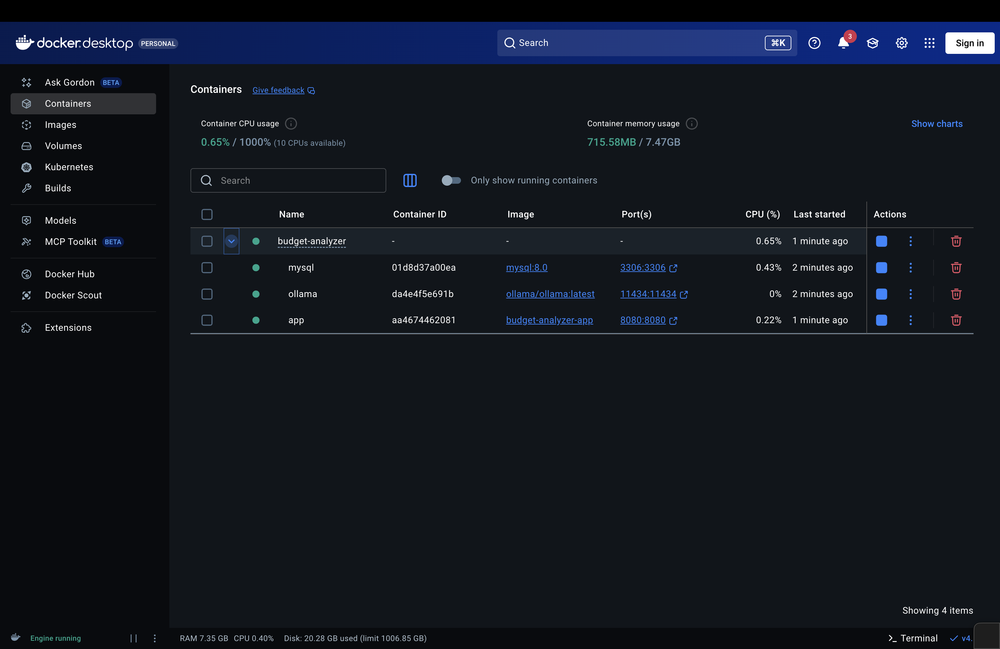
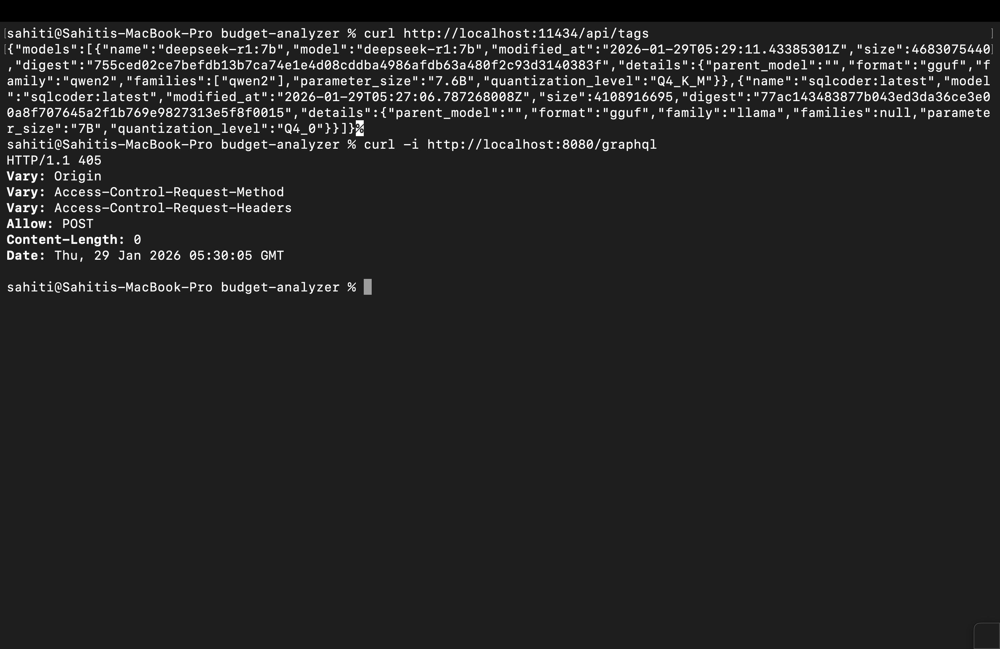

## Budget Analyzer (Backend)

**Budget Analyzer backend:** a Spring Boot GraphQL API (MySQL) that turns natural-language questions into spending insights via Ollama.

Budget Analyzer helps users **set up a budget cycle**, **track transactions**, and get **AI-generated insights** about spending via natural-language prompts.

AI is powered by **Ollama**:
- **Text-to-SQL** using `sqlcoder:latest` (generates safe MySQL SELECT queries)
- **Insight generation** using `deepseek-r1:7b` (turns query results into short explanations)

Repo: `https://github.com/schandr5/budget-analyzer`

### UI project (Angular)
The UI for this app lives in a separate repository (registration, login, salary setup, and expense tracking UI).

UI repo: `https://github.com/schandr5/budget_analyzer_ui`

### What this backend provides
- **User + budget setup** (create account, start/end budget cycles)
- **Budget cycle management** (modify existing budget allocation, start a new cycle)
- **Transaction management** (add + fetch transactions, categorize, auto-prioritize)
- **AI insights** (`fetchInsights` GraphQL query) from natural language prompts

### Prerequisites
- **Docker Desktop** (includes `docker compose`)
- (Optional) Git

### Quickstart (Docker Compose)
This runs **MySQL + Ollama + backend** locally with one command.

#### 1) Clone the repo

```bash
git clone https://github.com/schandr5/budget-analyzer.git
cd budget-analyzer
```

#### 2) Create your `.env`

```bash
cp .env.example .env
```

Refer to `.env.example` for the available variables. You can edit `.env` if you want a different MySQL password or DB name.

#### 3) Start everything

```bash
docker compose up --build -d
```

- Backend runs on `http://localhost:8080`
- GraphQL endpoint: `http://localhost:8080/graphql`
- Ollama runs on `http://localhost:11434`
- MySQL runs on `localhost:3306`

#### 4) Pull the Ollama models (first time only)

In a second terminal:

```bash
docker compose exec ollama ollama pull sqlcoder:latest
docker compose exec ollama ollama pull deepseek-r1:7b
```

To verify Ollama sees models:

```bash
curl http://localhost:11434/api/tags
```

### Example usage (GraphQL)

Use any GraphQL client (Postman/Insomnia). The schema is in `src/main/resources/graphql/schema.graphqls`.

#### AI insights query

```graphql
query {
  fetchInsights(budgetId: 1, prompt: "Where did I overspend in May 2026?")
}
```

#### Sample prompts (copy/paste)
- "Where did I overspend in May 2026?"
- "How much did I spend in May and June 2026 on Utilities?"

### Configuration
The backend is configured via environment variables (Compose sets these automatically):
- **MySQL**
  - `SPRING_DATASOURCE_URL`
  - `SPRING_DATASOURCE_USERNAME`
  - `SPRING_DATASOURCE_PASSWORD`
- **Ollama**
  - `OLLAMA_GENERATE_URL` (default: `http://localhost:11434/api/generate`)
  - `OLLAMA_MODEL` (default: `sqlcoder:latest`)
  - `OLLAMA_DEEPSEEK_MODEL` (default: `deepseek-r1:7b`)

### Screenshots

Budget Planner Application & Backend Health Check screenshots:





### Stopping / resetting
- Stop containers:

```bash
docker compose down
```

- Stop + delete DB + Ollama downloaded models:

```bash
docker compose down -v
```

### Notes
#### Common issues
- **No models found**: run the `ollama pull ...` commands above.

